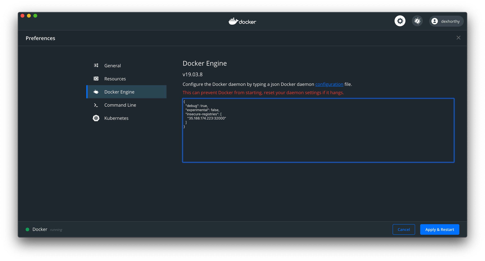

### Appendix: End to End GCP example

We'll set up these 3 instances in GCP. Unless otherwise specified, all commands are being run from a MacOS workstation outside this environment.

```
airgap-jump                                      us-central1-b  n1-standard-1                10.240.0.127  35.193.94.81     RUNNING
airgap-cluster                                   us-central1-b  n1-standard-1                10.240.0.41                    RUNNING
airgap-workstation                               us-central1-b  n1-standard-1                10.240.0.26                    RUNNING
```


**Note**: This guide does a lot of network configuration for address management, but omits any details regarding opening ports. While you could open specific ports between instances, this guide was written with inter-instance traffic wide open.

We'll use ssh tunneling for reaching the instances in the cluster, so it shouldn't be necessary to open ports for access from the outside world.

#### jump box

Create an jump box with a public IP and SSH it, this will be our jump box w/ internet access and also access to the airgapped environment


```
export INSTANCE=airgap-jump; gcloud compute instances create $INSTANCE --boot-disk-size=200GB --image-project ubuntu-os-cloud --image-family ubuntu-1804-lts --machine-type n1-standard-1
```

#### airgapped workstation

create a GCP vm to be our airgapped workstation. We'll give it outbound network access for now to facilitate installing docker, but then we'll disconnect it from the internet. Replace `dex` in the `usermod` command with your unix username in GCP.


```shell script
export INSTANCE=airgap-workstation; gcloud compute instances create $INSTANCE --boot-disk-size=200GB --image-project ubuntu-os-cloud --image-family ubuntu-1804-lts --machine-type n1-standard-1
```

```shell script
export LINUX_USER=dex
gcloud compute ssh airgap-workstation -- 'sudo apt update && sudo apt install -y docker.io'
gcloud compute ssh airgap-workstation -- "sudo usermod -aG docker ${LINUX_USER}"
gcloud compute ssh airgap-workstation -- 'sudo snap install kubectl --classic'
```

Next, remove the machine's public IP.

```shell script
gcloud compute instances delete-access-config airgap-workstation
```

verify that internet access was disabled by ssh'ing via the jump box and trying to curl kubernetes.io. We'll forward the agent so that we can ssh the airgapped workstation without moving keys around

```shell script
gcloud compute ssh --ssh-flag=-A airgap-jump -- "ssh airgap-workstation 'curl -v https://kubernetes.io'"
```

this command should hang, and you should see something with `Network is unreachable`:

```text
  0     0    0     0    0     0      0      0 --:--:--  0:00:02 --:--:--     0*   Trying 2607:f8b0:4001:c05::64...
* TCP_NODELAY set
* Immediate connect fail for 2607:f8b0:4001:c05::64: Network is unreachable
  0     0    0     0    0     0      0      0 --:--:--  0:00:03 --:--:--     0
```


#### airgapped cluster with registry

create a GCP vm with online internet access, this will be our airgapped cluster, but we'll use a an internet connection to install k8s and get a registry up and running.

```shell script
INSTANCE=airgap-cluster; gcloud compute instances create $INSTANCE --boot-disk-size=200GB --image-project ubuntu-os-cloud --image-family ubuntu-1804-lts --machine-type n1-standard-4
```

 Before installing Docker and Kubernetes, let's get the private IP and set it as an insecure docker registry

```shell script
export CLUSTER_PRIVATE_IP=$(gcloud compute instances describe airgap-cluster --format='get(networkInterfaces[0].networkIP)')
# verify
echo ${CLUSTER_PRIVATE_IP}
```

```shell script
 gcloud compute ssh airgap-cluster -- "sudo mkdir -p /etc/docker"
 gcloud compute ssh airgap-cluster -- "echo \"{\\\"insecure-registries\\\":[\\\"${CLUSTER_PRIVATE_IP}:32000\\\"]}\" | sudo tee /etc/docker/daemon.json"
```


Now, let's ssh into the instance and bootstrap a minimal kubernetes cluster (details here:  https://kurl.sh/1010f0a  )

```shell script
gcloud compute ssh airgap-cluster -- 'curl  https://k8s.kurl.sh/1010f0a  | sudo bash'
```

deploy a minimal registry and verify it's running

```shell script
gcloud compute ssh airgap-cluster -- 'kubectl --kubeconfig ./admin.conf apply -f https://gist.githubusercontent.com/dexhorthy/7a3e6eb119d2d90ff7033a78151c3be2/raw/6c67f95367988d1a016635e3da689e2d998d458c/plain-registry.yaml'
```

This gist configures a basic auth htpasswd that configures a username/password for `kots/kots`, which we'll use later

```shell script
gcloud compute ssh airgap-cluster -- 'kubectl --kubeconfig ./admin.conf get pod,svc -n registry'
```

Now that the registry is up, let's verify that we can docker push/pull to it. We'll use the public IP attached to the instance.

```text
export INSTANCE_IP=34.66.168.81
docker login --username kots --password kots ${INSTANCE_IP}:32000
docker pull busybox
docker tag busybox ${INSTANCE_IP}:32000/busybox
docker push ${INSTANCE_IP}:32000/busybox
```

you may need to also add an `insecure-registy` entry to allow pushing/pulling via http instead of https. If you're testing from docker-for-mac, you can add this via the setttings:




Next, remove the machine's public IP. We'll use the kubeconfig from this server later.

```shell script
gcloud compute instances delete-access-config airgap-cluster
```

verify that internet access was disabled by ssh'ing via the jump box and trying to curl kubernetes.io. We'll forward the agent so that we can ssh the airgapped cluster without moving keys around

```shell script
gcloud compute ssh --ssh-flag=-A airgap-jump -- "ssh airgap-cluster 'curl -v https://kubernetes.io'"
```

this command should hang, and you should see something with `Network is unreachable`:

```text
  0     0    0     0    0     0      0      0 --:--:--  0:00:02 --:--:--     0*   Trying 2607:f8b0:4001:c05::64...
* TCP_NODELAY set
* Immediate connect fail for 2607:f8b0:4001:c05::64: Network is unreachable
  0     0    0     0    0     0      0      0 --:--:--  0:00:03 --:--:--     0
```


#### Final Workstation Setup


Now, let's verify our docker client on the workstation and make sure we have kubectl access properly configured before we do the full installation. We'll do this by ssh'ing the workstation via the jump box

###### Docker

First, let's get the IP address of our airgapped cluster so we can configure an insecure registry on the airgapped workstation:


Next, we can create a docker daemon config to trust this registry from the workstation and from the cluster. First, let's quickly verify that no existing daemon json config exists on the workstation (if it does, you'll have to modify the next step slightly to just add the registry setting)

```shell script
gcloud compute ssh --ssh-flag=-A airgap-jump -- "ssh airgap-workstation 'cat /etc/docker/daemon.json'"
```

Next, we can create a config with the insecure registry, then restart docker


```shell script
 gcloud compute ssh --ssh-flag=-A airgap-jump -- "ssh airgap-workstation 'echo \"{\\\"insecure-registries\\\":[\\\"${CLUSTER_PRIVATE_IP}:32000\\\"]}\" | sudo tee /etc/docker/daemon.json'"
 gcloud compute ssh --ssh-flag=-A airgap-jump -- "ssh airgap-workstation -- sudo systemctl restart docker"
```

Before proceeding, re-run the following command until docker has come back up:

```shell script
gcloud compute ssh --ssh-flag=-A airgap-jump -- "ssh airgap-workstation -- docker image ls"
```

and you see

```shell script
REPOSITORY          TAG                 IMAGE ID            CREATED             SIZE
```


We can verify connectivity with a login + pull of the image we previously pushed

```shell script
 gcloud compute ssh --ssh-flag=-A airgap-jump -- "ssh airgap-workstation -- docker login ${CLUSTER_PRIVATE_IP}:32000 --username kots --password kots"

# note we've hard-coded the IP here, not using the env var
 gcloud compute ssh --ssh-flag=-A airgap-jump -- "ssh airgap-workstation -- docker pull ${CLUSTER_PRIVATE_IP}:32000/busybox:latest"
```


you should see something like

```text
latest: Pulling from busybox
91f30d776fb2: Pulling fs layer
91f30d776fb2: Verifying Checksum
91f30d776fb2: Download complete
91f30d776fb2: Pull complete
Digest: sha256:2131f09e4044327fd101ca1fd4043e6f3ad921ae7ee901e9142e6e36b354a907
Status: Downloaded newer image for 10.240.0.100:32000/busybox:latest
10.240.0.100:32000/busybox:latest
```

###### Kubectl

next, ssh into the airgapped worksation and grab the `admin.conf` from the cluster and run a few kubectl commands to ensure its working

```shell script
gcloud compute ssh --ssh-flag=-A airgap-jump -- 'ssh -A airgap-workstation'
```

From the Airgapped workstation, run the following:

```shell script
scp airgap-cluster:admin.conf .
export KUBECONFIG=$PWD/admin.conf
kubectl get ns
kubectl get pod -n kube-system
```

you should see something like

```
NAME                                   READY   STATUS    RESTARTS   AGE
coredns-5644d7b6d9-j6gqs               1/1     Running   0          15m
coredns-5644d7b6d9-s7q64               1/1     Running   0          15m
etcd-airgap-2                      1/1     Running   0          14m
kube-apiserver-airgap-2            1/1     Running   0          14m
kube-controller-manager-airgap-2   1/1     Running   0          13m
kube-proxy-l6fw8                       1/1     Running   0          15m
kube-scheduler-airgap-2            1/1     Running   0          13m
weave-net-7nf4z                        2/2     Running   0          15m
```

Now, log out of the airgapped instance

```shell script
exit
```
